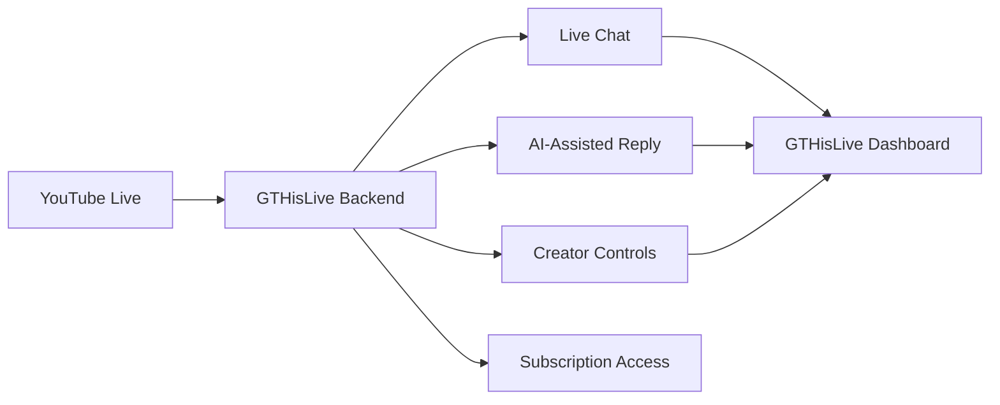

# GTHisLive

**AI Streaming Assistant & YouTube Live Chatbot for creators**

[Visit GTHisLive](https://gthislive-frontend.onrender.com/)

GTHisLive is a creator-focused platform for managing YouTube Live chat with AI-assisted replies, creator controls, and subscription-based access.

> **Note:** GTHisLive is an independent application and is not an official Google, YouTube, or Razorpay product.

## What GTHisLive Does

- **YouTube Live chat** — connect a YouTube account and work with live chat messages.
- **AI-assisted replies** — generate short, natural replies designed for live-stream conversations.
- **Creator dashboard** — manage the connected channel and chat automation from one place.
- **Reply protection** — helps reduce repetitive responses, including per-viewer reply cooldown behavior.
- **Subscriptions** — Free, Pro, and Premium access with server-side subscription state.
- **Google OAuth** — sign in and connect YouTube through Google's authorization flow.
- **Hosted billing** — paid subscriptions use Razorpay's hosted payment flow.

## How It Works

## Product Pages

- [Features](https://gthislive-frontend.onrender.com/features)
- [Docs](https://gthislive-frontend.onrender.com/docs)
- [YouTube Live AI Chatbot Guide](https://gthislive-frontend.onrender.com/youtube-live-ai-chatbot)
- [About](https://gthislive-frontend.onrender.com/about)
- [Pricing](https://gthislive-frontend.onrender.com/pricing)
- [Privacy](https://gthislive-frontend.onrender.com/privacy)
- [Terms](https://gthislive-frontend.onrender.com/terms)

## Tech Stack

### Frontend
- React
- Vite
- React Router
- Tailwind CSS
- Framer Motion

### Backend
- Python
- FastAPI
- PostgreSQL
- Google OAuth / YouTube APIs
- Gemini / AI services
- Razorpay subscriptions

### Deployment
- Render
- PostgreSQL

## Trust & Privacy

GTHisLive is designed around third-party authorization and hosted payment flows:

- Google handles Google account authentication through OAuth.
- YouTube access is granted through the permissions selected by the user.
- Razorpay provides the hosted payment experience.
- Subscription access is stored server-side rather than relying only on browser state.
- Never share a Google password, payment-card details, OTP, or other credentials with anyone claiming to represent GTHisLive.

For details, see the [Privacy Policy](https://gthislive-frontend.onrender.com/privacy) and [Terms](https://gthislive-frontend.onrender.com/terms).

## Repository Structure

This repository is a **public product showcase**.

The production application source code remains in a separate private repository. This showcase intentionally contains product information and documentation rather than the private production implementation.

## Status

GTHisLive is actively developed. Features, integrations, and user-facing behavior may continue to evolve.

## Website

**https://gthislive-frontend.onrender.com/**

---

Built for creators who want more control over their YouTube Live chat.
